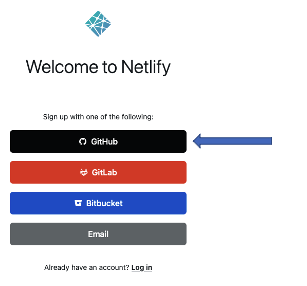
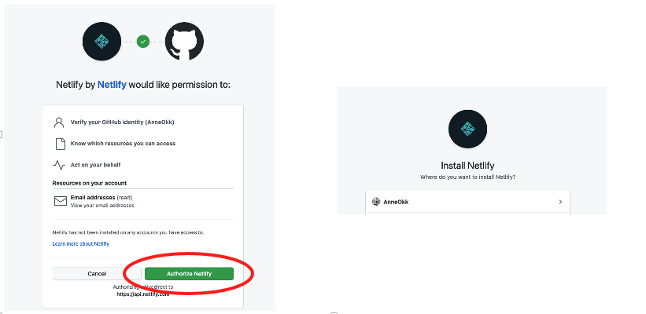
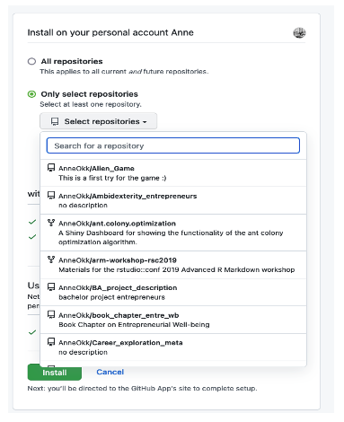
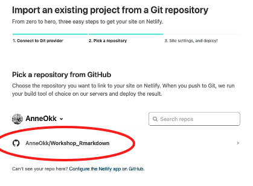
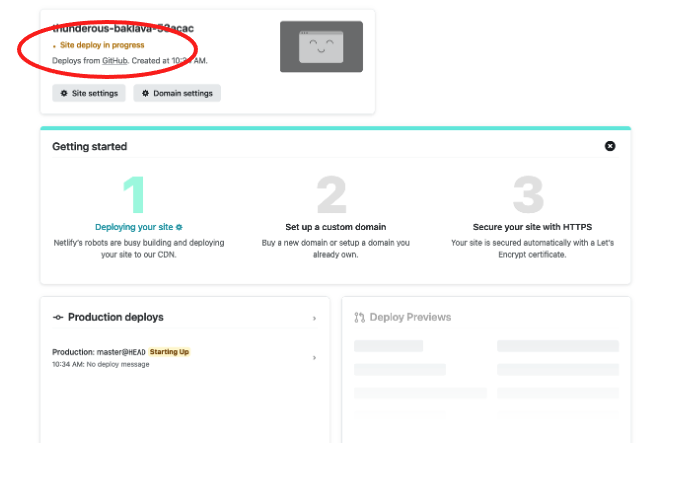
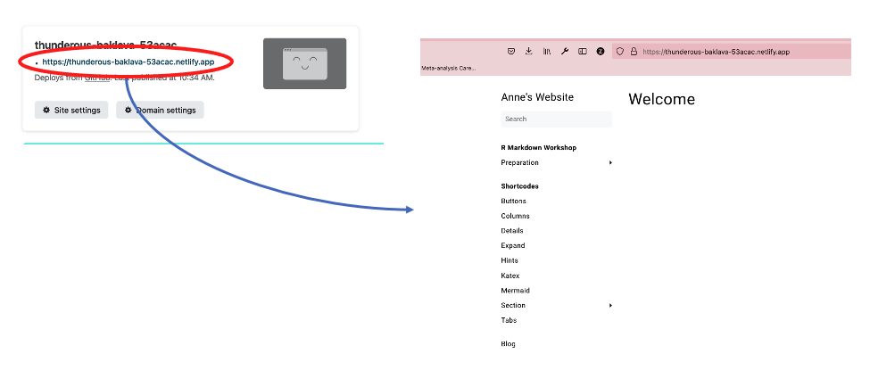

#  


# Creating a blog with blogdown

## Workflow

1. Choose a theme

2. Create a new Rstudio project

3. Add basic site with desired theme 

4. Push to GitHub

5. Edit the website

6. Publish the website 


## 1. Choose a theme

* See available themes: [https://](https://themes.gohugo.io/)[themes.gohugo.i](https://themes.gohugo.io/)[o](https://themes.gohugo.io/)

* We will use hugo-lithium for today, see: https://github.com/yihui/hugo-lithium


## 2. Create an R Project 

<u>In Rstudio:</u>

* Click “File” 
* “New project…” 
* choose “Existing Directory” 
* Browse to your project folder and create project here 


## 3. Create a basic website

* Go to console in your newly created project and install blogdown (if not done already):

```devtools::install_github('rstudio/blogdown') # install blogdown ```

* Initiate site: 

```blogdown::new_site(theme = 'yihui/hugo-lithium')```

* Serve and preview site


### Templates

* It is often helpful to use a template for a start or to get inspired by other people’s blog creations

* Recommended way: search for templates via GitHub 

* For example: https://github.com/yihui/hugo-xmin/tree/4bb305

  

## 4. Integrate with GitHub

* Create a new GitHub repository 

  

  

* add repository details

* In the terminal: navigate to the folder where your project lives 

  

  


* execute the following commands:

  ```git init```

  

  ```git remote add origin [link to remote repository]``` 

  

  ```git branch -M main``` (here you’re setting your current branch to “main” – remember this! You will have to push changes to main!)

  ```git add .``` (with this command, you’re staging all new files in this repo to be committed)

  ```git commit –m“just a test”``` (add a more informative commit message)

  ```git push origin main```

​	

## 5. Edit the website according to your wishes

* Play around with different folders! (Group task) 
  * **Serve** site to preview
  * **New post** for new entries
  * **Update metadata** to edit metadata of posts


## 6. Deployment 

* Different options, see https://bookdown.org/yihui/blogdown/deployment.html: 

  * Netlify

  * GitHub Pages

  * Travis + GitHub

  * GitLab Pages 


### Netlify 

* Sign up on netlify.com with your GitHub Account	

  

  

* Connect with GitHub and install Netlify 

  

  

* select project repository

  

* Set site settings 

  

* Deploy!

  

* Once your site is deployed, you may open the generated URL and check whether everything worked. You should see your website!

   