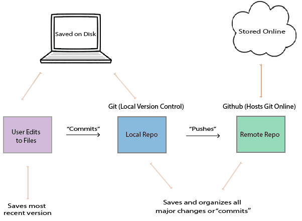
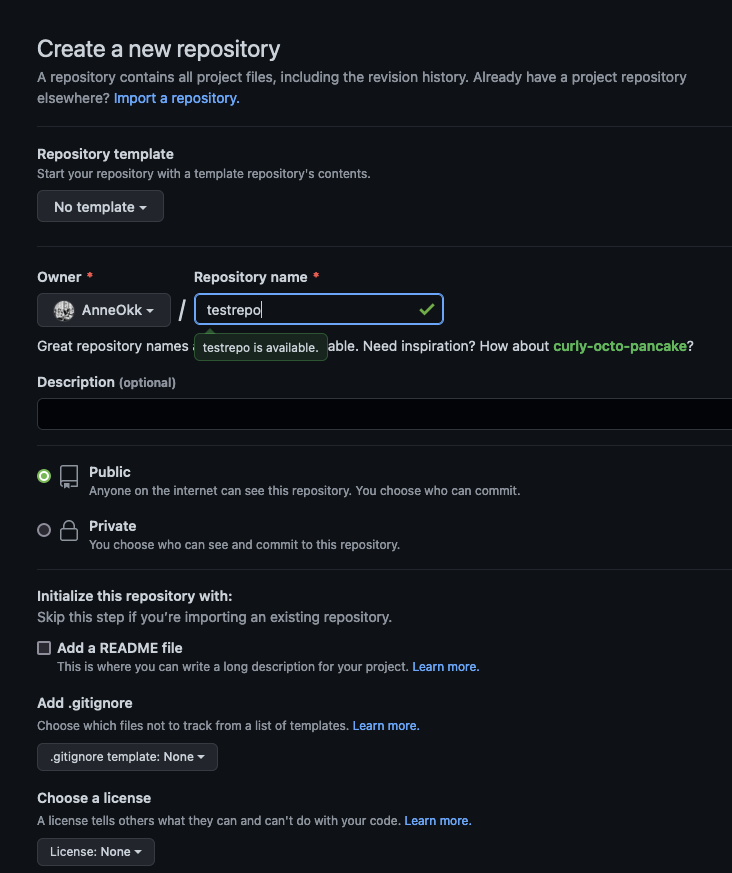
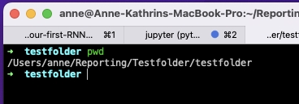

name: Rmarkdown Intro
class: left, middle
background-image: url(img/yoal-desurmont-jqgsM3B9Fpo-unsplash.jpg)
background-size: cover

<h1><span style="color:white"> .fat[.fancy[R Markdown Workshop - Day 2]]</span>
<br /> 
<br /> 

<h2><span style="color:white"> .fancy[Creation, organisation, storage, and collaboration]</span>

<h3><span style="color:white"> Anne-Kathrin Kleine | University of Groningen </span>


<!-- this ends up being the title slide since seal = FALSE-->


```{r setup, include=FALSE}
options(htmltools.dir.version = FALSE)
library(knitr)
knitr::opts_chunk$set(warning = FALSE, message = FALSE)
# options(knitr.table.format = "html")
library(tidyverse)
library(babynames)
library(fontawesome) # from github: https://github.com/rstudio/fontawesome
library(DiagrammeR)
library(rmarkdown)
library(haven)

hook_source <- knitr::knit_hooks$get('source')
knitr::knit_hooks$set(source = function(x, options) {
  x <- stringr::str_replace(x, "^[[:blank:]]?([^*].+?)[[:blank:]]*#<<[[:blank:]]*$", "*\\1")
  hook_source(x, options)
})
```


<style type="text/css">

.hljs-github .hljs {
    background: #D3D3D3;
}

.inline-c, remark-inline-code {
   background: #228B22;
   border-radius: 3px;
   padding: 4px;
   font-family: 'Source Code Pro', 'Lucida Console', Monaco, monospace;
}


.blue-h{
   background: #1261A0;
}


.out-t, remark-inline-code {
   background: #1261A0;
   border-radius: 3px;
   padding: 4px;
   
}

.pull-left-c {
    float: left;
    width: 58%;
    
}

.pull-right-c {
    float: right;
    width: 38%;
    
}

.left2 {
  margin: 0;
  position: absolute;
  top: 50%;
  left: 20%;
  -ms-transform: translate(-50%, -50%);
  transform: translate(-50%, -50%);
    
}

--

.right2 {
  margin: 0;
  position: absolute;
  top: 50%;
  left: 80%;
  -ms-transform: translate(-50%, -50%);
  transform: translate(-50%, -50%);
    
}

--

.center2 {
  margin: 0;
  position: absolute;
  top: 50%;
  left: 50%;
  -ms-transform: translate(-50%, -50%);
  transform: translate(-50%, -50%);
}


.medium {
    font-size: 75%
}

.small {
    font-size: 50%
    }

.action {
    background-color: #f2eecb;
  
}


</style>
    

<!-- this adds the link footer to all slides, depends on my-footer class in css-->


---
class: middle, inverse

# .fat[.fancy[Version control]]

---
class: middle, inverse

## .fancy[Version control]

.pull-left[
- Research papers have many versions before publication
- two main challenges emerge:
  - keeping track of changes and versions
  - reverting a previous version if necessary 
- different approaches for version control:
  - edit, rename and save files
  - use applications (Dropbox, Google Docs, Overleaf)
  - use version control systems such as Git and GitHub 
]

.pull-right[
```{r eval=FALSE}
manuscript
   |
   |- journals_FINAL_19May.Rmd
   |- journals_PAPERVERS_17May.Rmd
   |- journals_10May.Rmd
   |- journals_FINAL.Rmd
   |- journals_26APRIL_newliterature.Rmd
   
   ...
   
   |- journals.Rproj
   |- references.bib  
   |- apa_7th.csl
   
```
]
---
class: middle, inverse

# .fat[.fancy[Version control with Git and GitHub]]

---

class: middle, inverse

## .fancy[Advantages of using Git and GitHub]

.pull-left[


#### 🎈 Contribute to open source projects, see [here](https://www.dataschool.io/how-to-contribute-on-github/)
- almost all open source projects use GitHub

#### 🎤 Showcase your work


#### 🔍 Track changes across versions 
]

.pull-right[
#### 👨‍🔬 👷‍♀️ Collaborate on projects 


#### 🤹‍♂️ Various integration options
- GitHub can integrate with many common platforms such as Amazon and Google Cloud; or use GitHub pages or Netlify to build websites based on your R (Markdown) files 
]
---
class: middle, inverse

## .fancy[Version Control &mdash; Git and GitHub &mdash; Definitions]

### Git 

- a software that keeps track of versions of a set of files
- it is *local* to you; the records are kept on your computer

--

### GitHub 

- a hosting service, or a website, that can keep the records
- it is *remote* to you, like the Dropbox website
- but unlike Dropbox, GitHub is specifically structured to keep records with Git


---
class: middle, inverse

## .fancy[Version Control &mdash; Git and GitHub &mdash; Definitions]

### Repository, or repo
- a set of files whose records are kept together, by Git and/or on GitHub
- it is like a folder, which can keep files and other folders containing files

--

### To commit
- to take a snapshot of, or to version, a repository
- it is like saving a new version of all files and sub-folders in your project folder with a new name
- it is local, the records are kept on your computer unless you push

--

### To push
- to move a copy of the records from Git to GitHub, from your computer to online server
- it is like uploading (the new versions of) your files and sub-folders to a website

---

class: center, inverse

## .fancy[Version Control &mdash; Git and GitHub]



---

class: middle, inverse

## .fat[.fancy[How familiar are you with using the command line (terminal, power shell...)?]] 

### Go to [www.menti.com](www.menti.com) 🤸 and enter the code **6059 2895** 

### [See results](https://www.mentimeter.com/app/presentation/8377d55da27523147614cd11aba6f796/82eb3869f165)

---


class: middle, inverse

## .fancy[Version Control &mdash; Git and GitHub &mdash; check setup]

#### In the 📱 terminal 📱, type ` git --version ` 
- you should see the Git version  ✅

#### In the 📱 terminal 📱, type ` git config --global user.name ` 
- you should see the Git user name  ✅

<br /> 

#### 🚫  If these steps did not work, go back [here](https://docs.github.com/en/get-started/getting-started-with-git/setting-your-username-in-git) and continue setting up Git where you left off

---

class: middle, inverse

## .fancy[Version Control &mdash; Git and GitHub &mdash; connect local with remote]

.pull-left[
#### 1. Go to GitHub and create a new repository 


]

.pull-right[

#### 2. Fill in some info, create a public repository (don't bother with Readme etc - those will be added later!)



]
---

class: middle, inverse

## .fancy[Version Control &mdash; Git and GitHub &mdash; connect local with remote]

.pull-left[
#### 3. Follow the steps in Option 1: .blue-h["…create a new repository on the command line"] 


]

.pull-right[

#### 4. In the 📱 terminal 📱, navigate to your R project folder 

]

---

class: middle, inverse

## .fancy[Version Control &mdash; Git and GitHub &mdash; connect local with remote]

.pull-left[
#### 5. In the 📱 terminal 📱, type:

.blue-h[`git init`] this initializes a git repo on your local machine

.blue-h[`git add .`] this stages all the content in that folder to be committed

.blue-h[`git commit -m "fist commit"`] stages all content to be pushed in next step

.blue-h[`git remote add origin https://github.com/AnneOkk/testrepo.git`] substitute with your repo URL 

]

.pull-right[

.blue-h[`git push origin master`] push all the content from Git to GitHub


]

--

### 🎈 .fancy[Pushed files should appear in GitHub repository] 🎈

---

class: middle, inverse

## .fancy[Version Control &mdash; Git and GitHub &mdash; .gitignore]

.pull-left[

- .blue-h[`.gitignore`] file specifies which file(s) and/or folder(s) should be excluded from version control

- lists one item per line; each line has a pattern, which determines whether files should be ignored 

- see [gitignore documentation](https://git-scm.com/docs/gitignore) for more info on the different patterns 

- reasons to exclude files from being pushed include:
  - personal information others should not see (e.g., credential files)
  - no rights to share (e.g., certain data files)
  - outputs that may be re-created (e.g., `outputs.pdf`)

]

.pull-right[


### 🎈 Pushed files should appear in GitHub repository 🎈
]
---


class: middle, inverse

# .salt[.fancy[Your turn! 🤹]]

1.  Connect your local R project folder to GitHub repository

2. Change some of the content in R, save, and then push the changes to GitHub
  - .blue-h[`git add .`]
  - .blue-h[`git commit -m "senseful commit message that describes the change(s)"`]
  - .blue-h[`git push origin master`]

    <br /> 

3. [OPTIONAL] 


