name: Rmarkdown Intro
class: left, middle
background-image: url(img/yoal-desurmont-jqgsM3B9Fpo-unsplash.jpg)
background-size: cover

<h1><span style="color:white"> R Markdown</span>


<h2><span style="color:white"> .fancy[Making slides in R Markdown]</span>

<h3><span style="color:white"> Anne-Kathrin Kleine | University of Groningen </span>


<!-- this ends up being the title slide since seal = FALSE-->


```{r setup, include=FALSE}
options(htmltools.dir.version = FALSE)
library(knitr)
knitr::opts_chunk$set(warning = FALSE, message = FALSE)
# options(knitr.table.format = "html")
library(tidyverse)
library(babynames)
library(fontawesome) # from github: https://github.com/rstudio/fontawesome
library(DiagrammeR)
library(rmarkdown)
library(haven)

hook_source <- knitr::knit_hooks$get('source')
knitr::knit_hooks$set(source = function(x, options) {
  x <- stringr::str_replace(x, "^[[:blank:]]?([^*].+?)[[:blank:]]*#<<[[:blank:]]*$", "*\\1")
  hook_source(x, options)
})


```


<style type="text/css">

.hljs-github .hljs {
    background: #D3D3D3;
}

.inline-c, remark-inline-code {
   background: #228B22;
   border-radius: 3px;
   padding: 4px;
   font-family: 'Source Code Pro', 'Lucida Console', Monaco, monospace;
}


.blue-h{
   background: #1261A0;
}


.out-t, remark-inline-code {
   background: #1261A0;
   border-radius: 3px;
   padding: 4px;
   
}

.pull-left-c {
    float: left;
    width: 58%;
    
}

.pull-right-c {
    float: right;
    width: 38%;
    
}

.medium {
    font-size: 75%
}

.small {
    font-size: 50%
    }

.action {
    background-color: #f2eecb;
  
}


</style>
    

<!-- this adds the link footer to all slides, depends on my-footer class in css-->

---
class: middle, inverse

## .fat[...takes the pain away]
### 💅 formatting and managing **code** and **analyses results** (tables, figures, citations, and equations) 
### 📕 convert output to pdf, html, word
### 🧘 increase reproducibility, decrease possibility of mistakes 

---

class: middle, inverse

## .fat[.fancy[Overview over the 2-day workshop]]

---
class: middle, inverse

## .fancy[Day 1:]

.pull-left[
#### R Markdown metadata
#### Writing text 
#### Reference management 
#### Writing code 
#### Figures, tables, and plots
]

.pull-right[

#### .fancy[GOAL 1] 💪 Being able to write your analysis scripts in R Markdown
#### .fancy[GOAL 2] 💪 Knit the output into a format of your choice (Word, html, pdf) 
#### .fancy[GOAL 3] 💪 Add text, figures/tables, and references to your R Markdown file 
#### .fancy[GOAL 4] 💪 Learn how to use R Markdown templates
]

---
class: middle, inverse

## .fancy[Day 2:]

#### Collaboration and version control using Git and GitGub

  * .fancy[GOAL 4] 💪 Create publishable data analysis folder and push your code and output to GitHub

    
#### Use **Blogdown** for creating your own websites/ blogs to host analyses outputs (or for other use) 

  * .fancy[GOAL 5] 💪 Build your own website using blogdown


#### GitHub on osf integration

  * .fancy[GOAL 6] 💪 Crate an anonymous project site on osf using your GitHub repositories 

#### Optional: Introduction to shiny apps

---

class: middle, inverse

# .fancy[General organization:]

### You will work in pairs of 2 (switching after every part)
### ❔ If you have questions ❔
#### 1. Ask you buddy 🙆
#### 2. Google (together) 👨‍💻👩‍💻
#### 3. Ask me 👷‍

---


class: middle, inverse

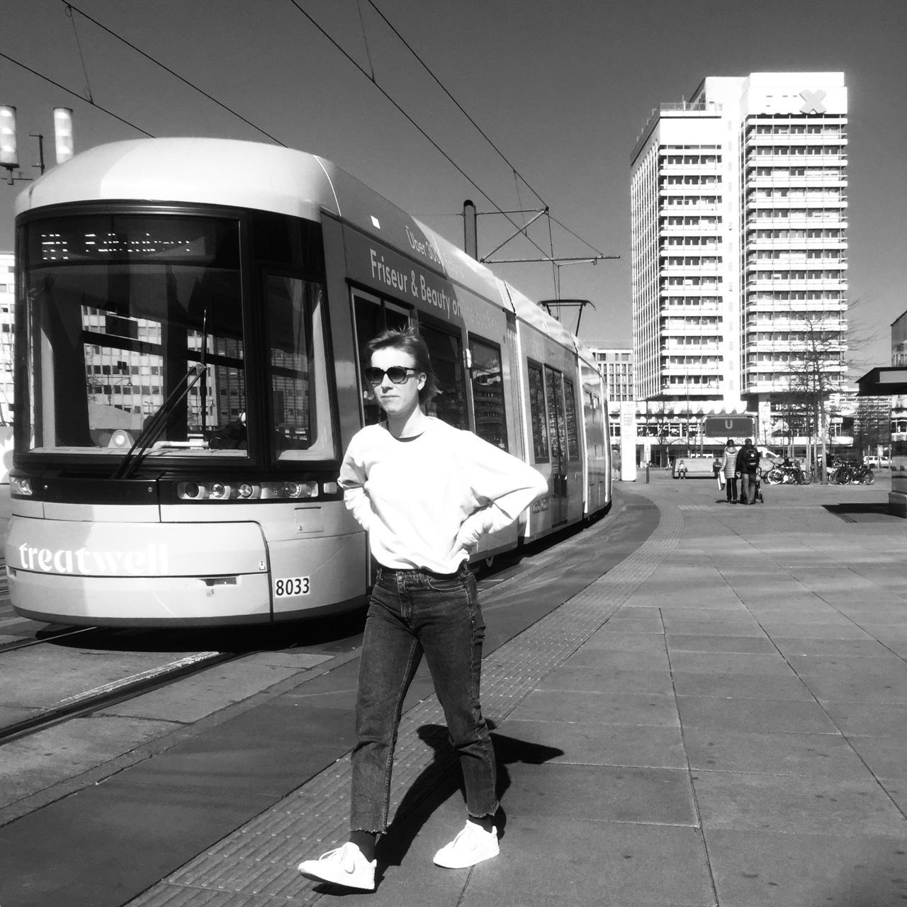

# Find me at...

[LinkedIn](https://linkedin.com/in/anne-kathrin-kleine)  
[GitHub](https://github.com/AnneOkk)  
[AnneKathrinKleine.com](https://AnneKathrinKleine.com)  
[a.k.kleine@rug.nl](mailto:alison@rstudio.com)


---
class: middle, inverse

# Did you do the <br> .fat[.fancy[setup?]]

.large[[Link to setup](https://anneokk.netlify.app/docs/r_markdown_workshop/preparation/preparation/)]

---
class: middle, inverse

### .fat[.fancy[R Markdown - an intro]]

### Create a new R Project from within R Studio

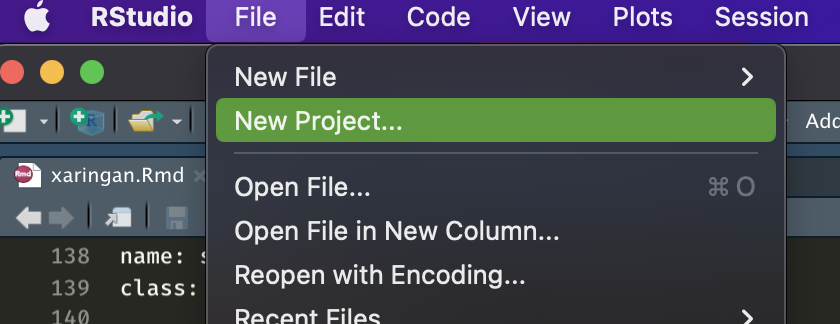
---
class: middle, inverse

### Save in new directory 

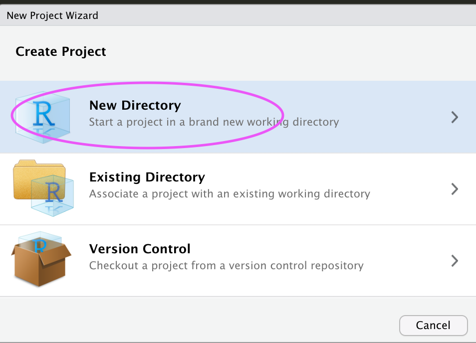

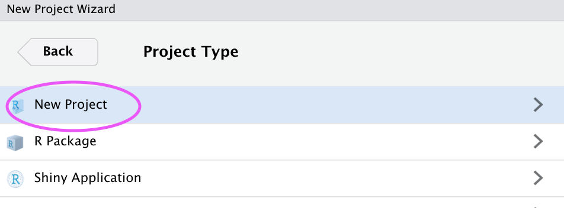

---
class: middle, inverse

### Choose the folder where you want to store your R Markdown file

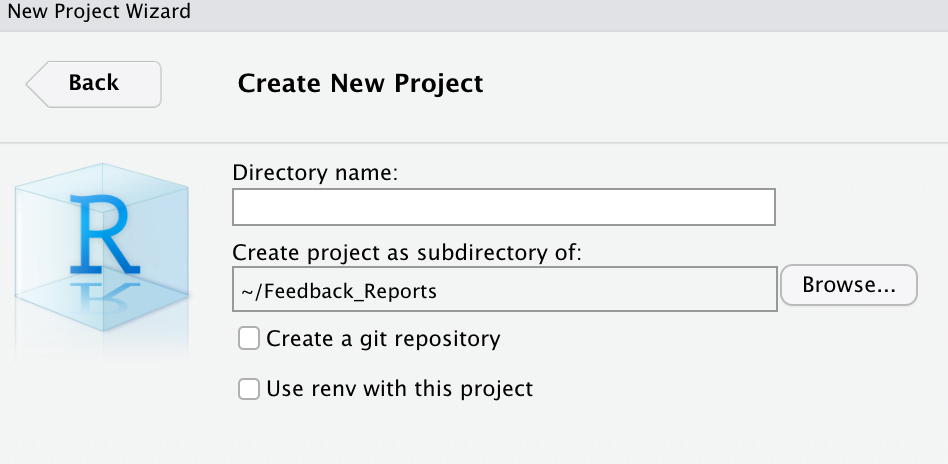


---

class: middle, inverse

### In that new folder, create an R Markdown file

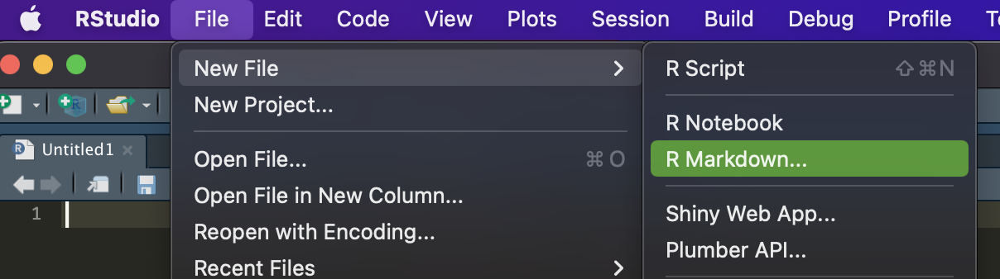


---
class: middle, inverse

### When you knit, the following happens:


### knit executes the code if there is any, converts the resulting document from .Rmd (R Markdown) into .md (Markdown)
### pandoc transforms the .md document into your preferred output format(s) (e.g., word, pdf, html)

---
class: middle, inverse

# .fat[.fancy[The YAML header]]

---
class: middle, inverse

## .fancy[YAML  &mdash; General]

YAML includes the metadata variables
- e.g., title, output format    
- written between a pair of three hyphens .blue-h[-]


```{r, eval=FALSE}
---  #<
title: 
output:
---  #<<
```

---
class: middle, inverse

## .fancy[YAML &mdash; Variables]

- see [Pandoc User's Guide](https://pandoc.org/MANUAL.html) and [R Markdown Cheat Sheet](https://github.com/rstudio/cheatsheets/raw/master/rmarkdown-2.0.pdf) for documentation and help

- Typical YAML variables for an research paper are as follows:

```{r, eval=FALSE}
---
title: 
author: 
date: 
bibliography: 
csl: 
output: 
---
```

---
class: middle, inverse

## .fancy[YAML &mdash; Variables]

Variables can be provided as .blue-h[strings]

```{r, eval=FALSE}
---
title: "My very funny and descriptive article title" #<<
output:
---
```

---
class: middle, inverse

## .fancy[YAML &mdash; Variables]

Variables can be provided as strings, .blue-h[options]

```{r, eval=FALSE}
---
title: "My very funny and descriptive article title"
output: pdf_document                                  #<<
---
```

---
class: middle, inverse

## .fancy[YAML &mdash; Variables]

Variables can be provided as strings, options, and .blue-h[sub-options]

```{r, eval=FALSE}
---
title: "My very funny and descriptive article title"
output: 
    pdf_document:
        keep_tex: true                   #<<
---
```

---
class: middle, inverse
## .fancy[YAML &mdash; Variables]

Variables can be provided as strings, options, sub-options, and .blue-h[code]

```{r, eval=FALSE}
---
title: "My very funny and descriptive article title"
output: 
    pdf_document:
        keep_tex: true
date: "\`r format(Sys.Date(), '%d %B %Y')`"      #<<
---
```
---
class: middle, inverse


## .fancy[YAML &mdash; Variables &mdash; Output Formats]

.pull-left-c[

Documents as output formats include

- .blue-h[HTML]
    
```{r, eval=FALSE}
---
title: "Theming with bslib and thematic"
output: 
  html_document:
    code_folding: show
    theme:
      bg: "#202123"
      fg: "#B8BCC2"
      primary: "#EA80FC"
      secondary: "#00DAC6"
      base_font:
        google: Prompt
      heading_font:
        google: Proza Libre
---
```  
]    

.pull-right-c[

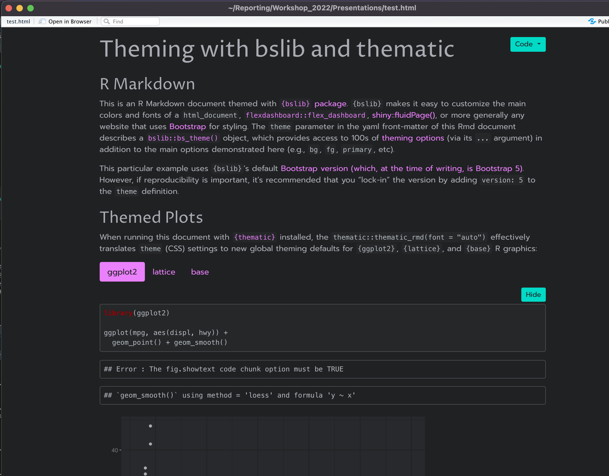

]

---
class: middle, inverse

## .fancy[YAML &mdash; Variables &mdash; Output Formats]

.pull-left-c[

Documents as output formats include

- HTML
- .blue-h[LaTeX]
    
```{r, eval=FALSE}
---
title: "Theming with bslib and thematic"
output: latex_document #<<
---
```  
]    

.pull-right-c[

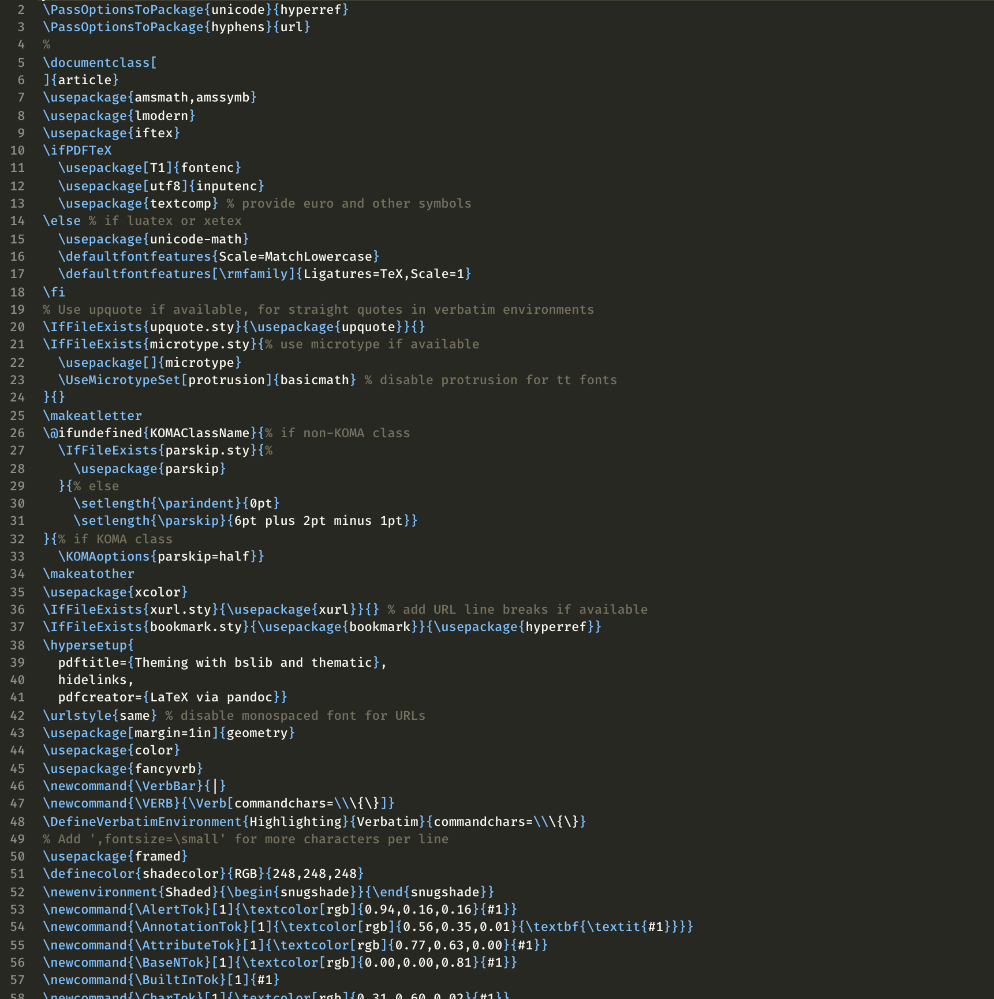

]

---
class: middle, inverse

##.fancy[ YAML &mdash; Variables &mdash; Output Formats]

.pull-left[

Documents as output formats include

- HTML
- LaTeX
- .blue-h[PDF]
    
```{r, eval=FALSE}
---
title: "Theming with bslib and thematic"
output: pdf_document #<<
---
```  
]    

.pull-right-c[

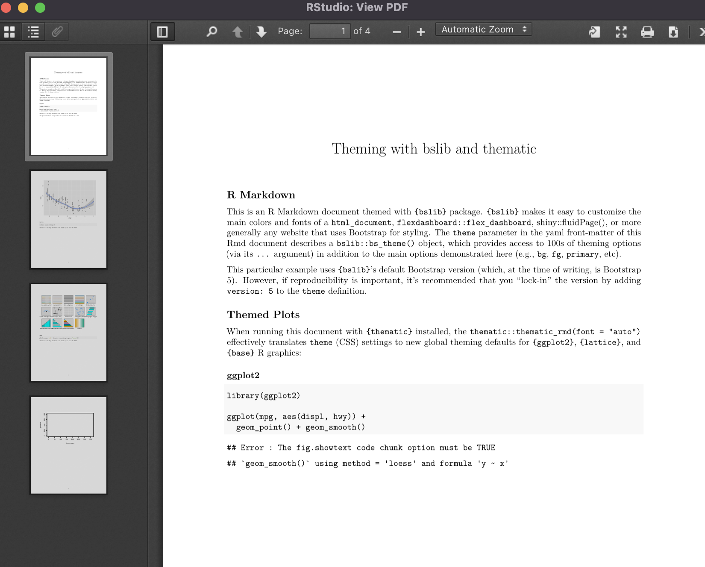

]

---
class: middle, inverse

## .fancy[YAML &mdash; Variables &mdash; Output Formats]

.pull-left-c[

Documents as output formats include

- HTML
- LaTeX
- PDF
- .blue-h[Word]
    
```{r, eval=FALSE}
---
title: "Theming with bslib and thematic"
output: word_document #<<
---
```  
]    

.pull-right-c[

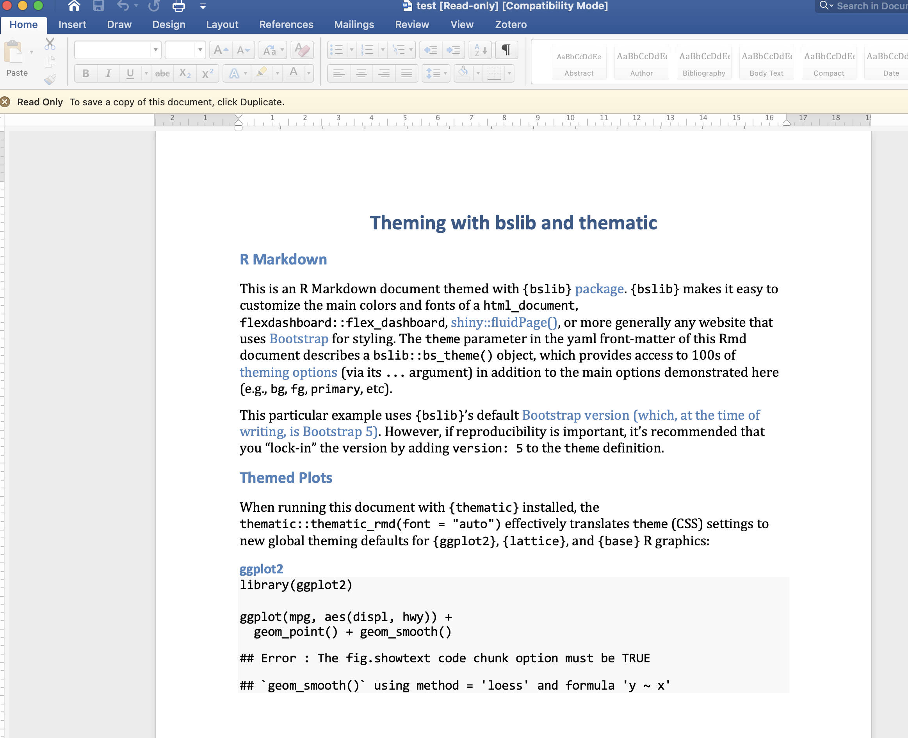

]

---
class: middle, inverse

### .salt[.fancy[YAML &mdash; Variables &mdash; Output Formats]]

.pull-left[

- Documents as output formats

  - `html_document`
  - `latex_document`
  - `pdf_document`<sup>*</sup>
  - `word_document`
  - `github_document`
  - `md_document`
  - `odt_document`
  - `rtf_document`

]
    
.pull-right[ 

- Presentations as output formats

  - `beamer_presentation`
  - `iosslides_presentation`
  - `powerpoint_presentation`
  - `slidy_presentation`

]    

.footnote[

<sup>*</sup> For reasons of simplicity, this workshop focuses on LaTex and/or PDF outputs. Different output formats have slightly different customisations. See [Pandoc User's Guide](https://pandoc.org/MANUAL.html) and/or [R Markdown Cheat Sheet](https://github.com/rstudio/cheatsheets/raw/master/rmarkdown-2.0.pdf).

]

---
class: middle, inverse

## .fancy[YAML &mdash; Strings &mdash; External Files]

```{r, eval=FALSE}
---
title: "Journal title"
author: "Jane Doe^[Department of Science, University of Random. Email: jane.doe@random.edu. Website: http://www.janedoe.com.]"                                    
date: 4 March 2022 
bibliography: references.bib   #<<
csl: apa.csl               #<<  
output: pdf_document                                    
---
```

---
class: middle, inverse

##  .fancy[YAML &mdash; Strings &mdash; External Files]

```{r, eval=FALSE}
---
...
bibliography: references/ref_library.bib                                    
csl: "../../paperstyle/csl/apa.csl" # two dots (..) mean moving one folder up
...
---
```
--

- ❕❗locations of files  re specified as .blue-h[relative to the working directory]❕❗
    
- for reproducibility reasons, hard-coded stings should be avoided 🙏
  -  e.g., `"C:/Users/Dropbox/styles/apa.csl"` 👎️

---

class: middle, inverse

# .fat[.fancy[Writing text]]
## slides source: [Resul Umit](https://resulumit.com/teaching/rmd_workshop.html#112)

---

class: middle, inverse
## Syntax &mdash; Overview

### R Markdown follows the syntax in Pandoc's Markdown 

- for the complete rules of the syntax, see [Pandoc User's Guide](https://pandoc.org/MANUAL.html)
- for a useful summary of the syntax, see the [R Markdown Cheat Sheet](https://github.com/rstudio/cheatsheets/raw/master/rmarkdown-2.0.pdf)
   
---
class: middle, inverse

## Syntax &mdash; Lines

Multiple spaces on a given line are reduced to one

```{r eval=FALSE}
This is a sentence followed by four spaces.    This is another sentence on the same line.
```

.out-t[This is a sentence followed by four spaces.    This is another sentence on the same line.]

<br>

Line endings with fewer than two spaces are ignored

```{r eval=FALSE}
This is a sentence followed by one space.
This is another sentence on a new line.
```

.out-t[This is a sentence followed by one space. This is another sentence on a new line.]

---
class: middle, inverse

## Syntax &mdash; Hard Breaks

Two or more spaces at the end of lines introduce hard breaks, forcing a new line

```{r eval=FALSE}
This is a sentence followed by two spaces.  
This is another sentence on a new line.
```

.out-t[This is a sentence followed by two spaces.  
This is another sentence on a new line.]
 
---
class: middle, inverse

## Syntax &mdash; Line Blocks

Spaces on lines that start with a vertical line .blue-h[|] are kept

```{r eval=FALSE}
| a one-space indent
|     a five-space indent
|          a ten-space indent  
```

.out-t[

&nbsp;a one-space indent  
&nbsp;&nbsp;&nbsp;&nbsp;&nbsp;a five-space indent  
&nbsp;&nbsp;&nbsp;&nbsp;&nbsp;&nbsp;&nbsp;&nbsp;&nbsp;&nbsp;a ten-space indent  

]

---
class: middle, inverse

## Syntax &mdash; Block Quotes

Lines starting with the greater-than sign .blue-h[&#62;] introduce block quotes<sup>*</sup>

```{r, eval=FALSE}
> In God, we trust. All others must bring data. 
>
> --- Anonymous 
```

.out-t[

&nbsp;&nbsp;&nbsp;&nbsp;&nbsp;&nbsp;&nbsp;&nbsp;In God, we trust. All others must bring data.    
&nbsp;&nbsp;&nbsp;&nbsp;&nbsp;&nbsp;&nbsp;&nbsp;    
&nbsp;&nbsp;&nbsp;&nbsp;&nbsp;&nbsp;&nbsp;&nbsp; &mdash; Anonymous
]


---
class: middle, inverse

## Syntax &mdash; Paragraphs

One or more<sup>*</sup> blank lines introduce a new paragraph

```{r eval=FALSE}
This is the first sentence of a paragraph as it is preceded by a blank line. This is the second 
sentence of that paragraph, which is followed by a blank line. 
This is the first sentence of a *new paragraph* as it is preceded by a blank line. This is the 
second sentence of that paragraph, which is followed by a blank line.
```

.out-t[

This is the first sentence of a paragraph as it is preceded by a blank line. This is the second 
sentence of that paragraph, which is followed by a blank line.

This is the first sentence of a *new paragraph* as it is preceded by a blank line. This is the 
second sentence of that paragraph, which is followed by a blank line.

]

.footnote[

<sup>*</sup> Multiple blank lines between paragraphs reduce to one.

]

---
class: middle, inverse

## Syntax &mdash; Comments

Text with the syntax .inline-c[<!--].inline-c[comments -->] is omitted from output

```md
<!-- This paragraph needs re-writing -->
This is the first sentence of a paragraph as it is preceded by a blank line. This is the second 
sentence of that paragraph, which is followed by a blank line. 

This is the first sentence of a new paragraph <!-- I've removed italics --> as it is preceded 
by a blank line. This is the second sentence of that paragraph, which is followed by a blank 
line. 

```

.out-t[

This is the first sentence of a paragraph as it is preceded by a blank line. This is the second 
sentence of that paragraph, which is followed by a blank line.

This is the first sentence of a new paragraph as it is preceded by a blank line. This is the 
second sentence of that paragraph, which is followed by a blank line.

]

---
class: middle, inverse

## Syntax &mdash; Headers

The number sign .yellow-h[&#x23;] introduces headers; lower levels are created with additional signs &mdash; up to total five levels

.pull-left[

.inline-c[&#x23; Introduction] becomes

.out-t[

# Introduction

]

.inline-c[&#x23;&#x23; 1. Introduction] becomes

.out-t[

## 1. Introduction

]

]

.pull-right[

.inline-c[&#x23;&#x23;&#x23; 3.1 Introduction] becomes

.out-t[

### 3.1 Introduction

]

.inline-c[&#x23;&#x23;&#x23;&#x23; Introduction] becomes

.out-t[

#### Introduction

]
]
---

class: middle, inverse

## Syntax &mdash; Emphases {#emph}

A pair of single asterisk .blue-h[&#42;] or underscores .blue-h[&#95;] introduces italics

<span style="background-color: #228B22; border-radius: 3px; padding: 4px; font-family: 'Source Code Pro', 'Lucida Console', Monaco, monospace;">&#42;italics&#42;</span> becomes .out-t[*italics*]    

<span style="background-color: #228B22; border-radius: 3px; padding: 4px; font-family: 'Source Code Pro', 'Lucida Console', Monaco, monospace;">&#95;italics&#95;</span> becomes .out-t[*italics*] as well

<br>

A pair of double asterisk or underscores introduces bold  

<span style="background-color: #228B22; border-radius: 3px; padding: 4px; font-family: 'Source Code Pro', 'Lucida Console', Monaco, monospace;">&#42;&#42;bold&#42;&#42;</span> becomes .out-t[**bold**]

<span style="background-color: #228B22; border-radius: 3px; padding: 4px; font-family: 'Source Code Pro', 'Lucida Console', Monaco, monospace;">&#95;&#95;bold&#95;&#95;</span> becomes .out-t[**bold**] as well

<br>

These two rules can be combined

<span style="background-color: #228B22; border-radius: 3px; padding: 4px; font-family: 'Source Code Pro', 'Lucida Console', Monaco, monospace;">&#42;&#42;&#95;bolditalics&#95;&#42;&#42;</span> becomes .out-t[**_bolditalics_**]

<span style="background-color: #228B22; border-radius: 3px; padding: 4px; font-family: 'Source Code Pro', 'Lucida Console', Monaco, monospace;">&#95;&#42;&#42;bolditalics&#42;&#42;&#95;</span> becomes .out-t[_**bolditalics**_]  as well

---
class: middle, inverse

## Syntax &mdash; Strikethrough

A pair of double tildes .yellow-h[~] introduces strikethrough

<span style="background-color: #228B22; border-radius: 3px; padding: 4px; font-family: 'Source Code Pro', 'Lucida Console', Monaco, monospace;">&#126;&#126;strikethrough&#126;&#126;</span> becomes .out-t[~~strikethrough~~]

<br>

Strikethrough can be combined with italics or bold

<span style="background-color: #228B22; border-radius: 3px; padding: 4px; font-family: 'Source Code Pro', 'Lucida Console', Monaco, monospace;">&#42;&#42;&#126;&#126;strikebold&#126;&#126;&#42;&#42;</span> or <span style="background-color: #228B22; border-radius: 3px; padding: 4px; font-family: 'Source Code Pro', 'Lucida Console', Monaco, monospace;">&#95;&#95;&#126;&#126;strikebold&#126;&#126;&#95;&#95;</span>, they both become .out-t[**~~strikebold~~**]

<span style="background-color: #228B22; border-radius: 3px; padding: 4px; font-family: 'Source Code Pro', 'Lucida Console', Monaco, monospace;">&#126;&#126;&#42;&#42;strikebold&#42;&#42;&#126;&#126;</span> or <span style="background-color: #228B22; border-radius: 3px; padding: 4px; font-family: 'Source Code Pro', 'Lucida Console', Monaco, monospace;">&#126;&#126;&#95;&#95;strikebold&#95;&#95;&#126;&#126;</span>, they both become .out-t[~~**strikebold**~~] as well

<br>

<span style="background-color: #228B22; border-radius: 3px; padding: 4px; font-family: 'Source Code Pro', 'Lucida Console', Monaco, monospace;">&#42;&#126;&#126;strikeitalitcs&#126;&#126;&#42;</span> or <span style="background-color: #228B22; border-radius: 3px; padding: 4px; font-family: 'Source Code Pro', 'Lucida Console', Monaco, monospace;">&#95;&#126;&#126;strikeitalitcs&#126;&#126;&#95;</span>, they both become .out-t[*~~strikeitalitcs~~*] 

<span style="background-color: #228B22; border-radius: 3px; padding: 4px; font-family: 'Source Code Pro', 'Lucida Console', Monaco, monospace;">&#126;&#126;&#42;strikeitalitcs&#42;&#126;&#126;</span> or <span style="background-color: #228B22; border-radius: 3px; padding: 4px; font-family: 'Source Code Pro', 'Lucida Console', Monaco, monospace;">&#126;&#126;&#95;strikeitalitcs&#95;&#126;&#126;</span>, they both become .out-t[*~~strikeitalitcs~~*] as well

---

class: middle, inverse

## Syntax &mdash; External links

You can link text to URLs

<span style="background-color: #228B22; border-radius: 3px; padding: 4px; font-family: 'Source Code Pro', 'Lucida Console', Monaco, monospace;">&#91;visit my website](https&#58;//https:/annekathrinkleine.com/)</span> becomes .out-t[[visit my website](https://annekathrinkleine.com/)]

You can also link text to an email address

<span style="background-color: #228B22; border-radius: 3px; padding: 4px; font-family: 'Source Code Pro', 'Lucida Console', Monaco, monospace;">&#91;email me](mailto&#58;a.k.kleine@rug.nl)</span><sup>*</sup> becomes .out-t[[email me](mailto:a.k.kleine@rug.nl)]

<span style="background-color: #228B22; border-radius: 3px; padding: 4px; font-family: 'Source Code Pro', 'Lucida Console', Monaco, monospace;">&#60;a.k.kleine@rug.nlo&#62;</span> becomes .out-t[<a.k.kleine@rug.nl>]


---
class: middle, inverse

## Syntax &mdash; Equations

Inline equations go between a pair of single dollar signs "$" with no space between the signs and the equation itself

.inline-c[$E = mc^{2}$] becomes .out-t[*E = mc<sup>2</sup>*]

<br>

--

Block equations go in between a pair of double dollar signs &mdash; with or without spaces, it works

.inline-c[&#x24;&#x24;  E = mc^{2}].inline-c[&#x24;&#x24;] becomes


.out-t[

<center> <i> E = mc<sup>2</sup> </i> </center>

]


---
class: middle, inverse
## Syntax &mdash; Footnotes &mdash; Inline Notes

For inline footnotes, use the .inline-c[^[footnote]] syntax

.inline-c[Jane Doe^[Corresponding author.]] becomes .out-t[Jane Doe<sup>1</sup>]

<br>

.footnote[

.out-t[<sup>1</sup> Corresponding author.]

]


---
class: middle, inverse
## Syntax &mdash; Lists

Lines starting with asterisk .yellow-h[&#42;] as well as plus .yellow-h[&#43;] or minus .yellow-h[&#8722;] signs introduce lists

```{r eval=FALSE}
- books
- articles
- reports
```

.out-t[

- books
- articles
- reports

]

---
class: middle, inverse
## Syntax &mdash; Lists &mdash; Nesting

Lists can be nested within each other, with indentation

```{r eval=FALSE}
+ books
+ articles
    - published
    - under review
        + revised and resubmitted
    - work in progress
```

.out-t[

+ books
+ articles
    - published
    - under review
        + revised and resubmitted
    - work in progress
    
]

---
class: middle, inverse
## Syntax &mdash; Lists &mdash; Numbering

List items can be numbered

```{r eval=FALSE}
1. books
2. articles
    - published
    - under review
        + revised and resubmitted
    - work in progress
```

.out-t[

1. books
2. articles
    - published
    - under review
        + revised and resubmitted
    - work in progress

]

---
class: middle, inverse
.pull-left[### Dashes

Two hyphens grouped together introduce an en-dash

.inline-c[&#8208;&#8208;] becomes .out-t[&ndash;]


Three hyphens grouped together introduce an em-dash

.inline-c[&#8208;&#8208;&#8208;] becomes .out-t[&mdash;]
]
.pull-right[
### Subscripts and Superscripts

A pair of tildes introduces subscript

.inline-c[CO&#126;2&#126;] becomes .out-t[CO<sub>2</sub>]


A pair of carets introduces superscript

.inline-c[R&#94;2&#94;] becomes .out-t[R<sup>2</sup>]

]

---

class: middle, inverse

# .fat[.fancy[Reference management]]

---
class: middle, inverse
## References &mdash; Bibliography Database

.pull-left-c[
  - References are defined in .bib files
  
  - they follow the BibTeX format
  
  <br>
- `pandoc` looks for a .bib file, and for the definitions therein, to process citations
  
- .bib files are specified with the `bibliography` variable in YAML
  
  <br>
    
- `pandoc` can process a citation only if there is a linked entry in the .bib file
  
  
]


.pull-right-c[
  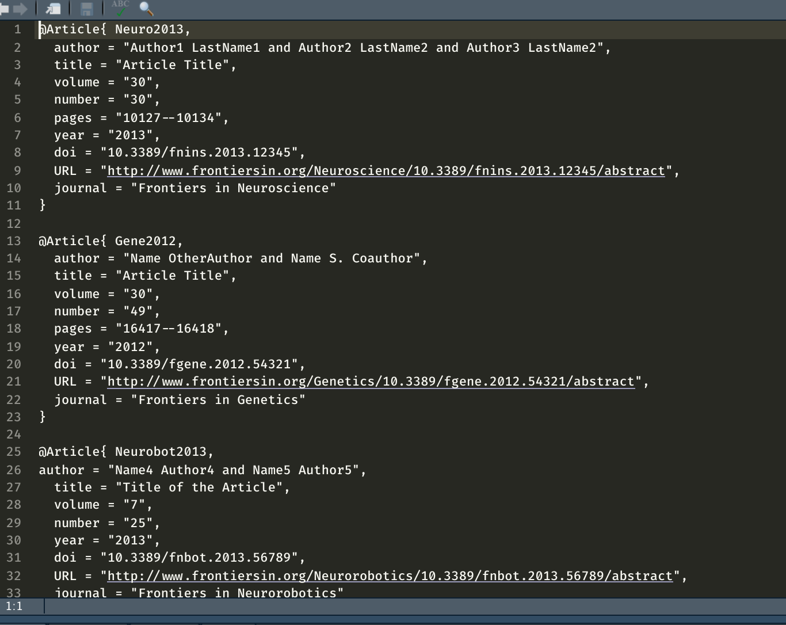
    
]

---
class: middle, inverse

## References &mdash; Bibliography Database &mdash; Entries
  
  .pull-left-c[
    
- A BibTeX entry consists of three elements
    - a type (e.g., `@article`)    
    - a citation-key (e.g., `bennett2015`)    
    - a number of tags (e.g., `title`, `author`)
    
    
  ]

---
class: middle, inverse

## References &mdash; Bibliography Database &mdash; Entries
  
### E.g., via `Google Scholar`:

#### follow `cite -> BibTex` and copy
#### paste into .bib, edit if necessary, and save

### Many other good options, e.g., [Zotero](https://christopherjunk.netlify.app/blog/2019/02/25/zotero-rmarkdown/#:~:text=In%20Zotero%20follow%20this%20path,and%20follow%20the%20system%20setup.), [Mendeley](https://rosannavanhespen.nl/rmarkdown/writing-your-thesis-with-r-markdown-2-text-citations-and-equations/#:~:text=Open%20Mendeley%20and%20select%20Mendeley,your%20R%20Markdown%20document%20lives.)

---
class: middle, inverse

## References &mdash; Style
  
- Reference styles are defined in .csl files

- files for different styles (e.g., APA) are available at [https://www.zotero.org/styles](https://www.zotero.org/styles)

<br>
  
- `pandoc` looks for a .csl file, and for the styles therein, to style citations and references

- .csl files are specified with the `csl` variable in YAML


<br>
  
- .csl files affect the style only in outputs

- no matter which the style is used, the citation syntax in .Rmd documents remains the same


---
class: middle, inverse

## References &mdash; In-text Citation Syntax &mdash; Author-Date Styles (APA 7)<sup></sup>
  


.pull-left[
  
  .inline-c[[@bennett2015]] becomes .out-t[(Bennett, 2015)]
  
  .inline-c[@bennett2015] becomes .out-t[Bennett (2015)]
  
  .inline-c[[-@bennett2015]] becomes .out-t[(2015)]
  
  .inline-c[-@bennett2015] becomes .out-t[2015]
  
  .inline-c[[@bennett2015 35]] becomes .out-t[(Bennett, 2015, p. 35)]
  
  .inline-c[[@bennett2015 33-35]] becomes .out-t[(Bennett, 2015, pp. 33&ndash;35)]
  
  
]


.pull-right[
  
  .inline-c[[@bennett2015, ch. 1]] becomes .out-t[(Bennett, 2015, ch. 1)]
  
  .inline-c[[@bennett2015; @gilbert2019]] becomes .out-t[(Bennett, 2015; Gilbert, 2019)]
  
  .inline-c[[see @bennett2015, for details]] becomes .out-t[(see Bennett, 2015, for details)]
  
  .inline-c[@bennett2015 [33-35]] becomes .out-t[Bennett (2015, pp. 33&ndash;35)]
  
]


---
class: middle, inverse

## Citations &mdash; Reference List


```{r eval=FALSE}
This is the last sentence of an APA style manuscript.
## References
```

.out-t[
  
  This is the last sentence of an APA style manuscript.
  
  ### References
  
  Bennett, S. (2015). Peanut butter and jelly. *Journal of Bone, 1*(12), 3–35.
  
  Gilbert, T. (2019). Turning wine into water. In M. Albert (Ed.), *The book of ground* (pp. 124–142). Antman.
  
]

---
class: middle, inverse

name: reference-links

## References &mdash; Internal Links

For internal links from in-text citations to the reference list, set .inline-c[link-citations: yes] in YAML

- a click on these links takes the screen to the relevant entry in the list
- the `linkcolor` variable make these links explicit


```{r, eval=FALSE}
---
...
bibliography: references.bib
csl: apa.csl
link-citations: yes    #<<
linkcolor: blue        #<<
...
---
```

---
class: middle, inverse

# .fat[.fancy[Code]]
## Slide source: [Resul Umit](https://resulumit.com/teaching/rmd_workshop.html#112)
## Data: [Superhero Dataset](https://domosoftware.sharepoint.com/:x:/s/CS-Edu-PublicFiles/EfRNaW_lszlHg-m2hMNZnLABv0bM12TTLVrS3MtSD1bzrw?e=f2gBgd)

---
class: middle, inverse

# Code, in and outside chunks
  
### Code chunks: 

```{r}
library(readxl)
library(dplyr) 
df <- read_excel("data/heroes_information.xlsx") %>% 
  na_if(., -99) %>% 
  mutate(bmi = round(Weight/((Height/100)**2)), 2) %>% 
  rename(., Water_allergy = Gender) %>% 
  mutate(Water_allergy = recode(Water_allergy, Male = "Yes", Female = "No")) %>% 
  select(., -...1, -`2`)

```


### Inline:

.inline-c[The average height of a superhero is  <span style="background-color: #e5e5e5; border-radius: 3px; padding: 4px; font-family: 'Source Code Pro', 'Lucida Console', Monaco, monospace;"><code>&grave;r round(mean(df$Height, na.rm = T), 2) &grave;</code></span> centimeter] becomes: 

The average height of a superhero is `r round(mean(df$Height, na.rm = T), 2)` centimeter.

---

class: middle, inverse

## Code Chunks
  
.pull-left-c[
    
- Code chunks are delimited spaces between a pair of three backticks `
- their output, if there is any, appears in the output document
    
<br>
      
- in curly brackets {, code chunks take
  
  - .blue-h[a language engine]
  - .blue-h[a label]
  - .blue-h[options]
      + The complete list of options is available at <https://yihui.org/knitr/options>
        
  ]    

.pull-right-c[

  ````md
  `r ''````{r, setup, echo=FALSE}
```
````
]

---
class: middle, inverse

## Some chunk options

#### .fancy[echo = FALSE] to exclude code 
````md
`r ''````{r, show_df, echo = FALSE}
head(df)
```
````

```{r, show_df, echo = FALSE}
head(df)
```

---
class: middle, inverse

## Some chunk options

#### .fancy[echo = TRUE] to include code and output 
````md
`r ''````{r, show_df_1, echo = TRUE}
head(df)
```
````

```{r, show_df_1, echo = TRUE}
head(df)
```

---
class: middle, inverse

## Some chunk options

#### .fancy[include = FALSE] to exclude entire chunk content (code and output)

````md
`r ''````{r, show_df_2, include = FALSE}
head(df)
```
````

```{r, show_df_2, include = FALSE}
head(df)
```

---

class: middle, inverse

## Some chunk options

#### .fancy[results = "hide"] to include only code (no output)

````md
`r ''````{r, show_df_3, results = "hide"}
head(df)
```
````

```{r, show_df_3, results = "hide"}
head(df)
```

---

class: middle, inverse

## Some chunk options

Cache results, useful for complex analyses:

````md
`r ''````{r ... cache=TRUE}
```
````

Prevent evaluation:

````md
`r ''````{r ... eval=FALSE}
```
````

Show results as produced by code (no transformation with `pandoc`, necessary for some packages (e.g., stargazer)):

````md
`r ''````{r ... results="asis"}
```
````

Prevent showing warnings, messages, errors:

````md
`r ''````{r ...error=FALSE, message=FALSE, warning=FALSE}
```
````

---
class: middle, inverse

### .salt[Code Chunks &mdash; The Setup Chunk]
  
It is recommended to use the first code chunk for general setup, where you can

- define .blue-h[your own defaults] for chunk options, with `knitr::opts_chunk$set()`
- load the necessary packages    
- import raw data

````md
`r ''````{r, setup, include=FALSE}
# `chunk option defaults`
knitr::opts_chunk$set(echo=FALSE, message=FALSE)
# `packages`
library(dplyr)
library(ggplot2)
library(stargazer)
library(readxl)
# `data`
df_raw <-read_excel("data/heroes_information.xlsx")
```
````

---

class: middle, inverse

### .salt[Code Chunks &mdash; The Data Chunk]
  
Second chunk for the main operations on raw data
- cleaning, transformations

````md
`r ''````{r, data, ...}
df <- read_excel("data/heroes_information.xlsx") %>% 
  na_if(., -99) %>% 
  mutate(bmi = round(Weight/((Height/100)**2)), 2) %>% 
  rename(., Water_allergy = Gender) %>% 
  mutate(Water_allergy = recode(Water_allergy, Male = "Yes", Female = "No")) %>% 
  select(., -...1, -`2`)

```
````
---
class: middle, inverse

 ## Inline Code &mdash; Overview
  
Code can also be incorporated in text, with the <span style="background-color: #e5e5e5; border-radius: 3px; padding: 4px; font-family: 'Source Code Pro', 'Lucida Console', Monaco, monospace;"><code>&grave;r &grave;</code></span> syntax


---
class: middle, inverse
## Inline Code &mdash; Examples
  
```{r, eval=FALSE, tidy=FALSE}
If we multiply _pi_ by 5, we get \`r pi * 5`.
```

.out-t[If we multiply _pi_ by 5, we get `r pi * 5`.]

<hr style="height:10px; visibility:hidden;" />
  
```{r, eval=FALSE, tidy=FALSE}
The average height of a superhero in the dataset is \`r mean(df$Height, na.rm = T)`, which would 
round to \`r round(mean(df$Height, na.rm = T), digits = 1)`.
```

.out-t[The average height of a superhero in the dataset is `r mean(df$Height, na.rm = T)`, which would round to `r round(mean(df$Height, na.rm = T), digits = 1)`.]

<hr style="height:10px; visibility:hidden;" />
  
```{r, eval=FALSE, tidy=FALSE}
__Only \`r nrow(subset(df, Height < 100))` superheros__ in the dataset are Smallings.
```

.out-t[__Only `r nrow(subset(df, Height < 100))` superheros__ in the dataset are Smallings.]

---

class: middle, inverse

# .fat[.fancy[Figures]]

---
class: middle, inverse
## Figures &mdash; Images &mdash; Markdown Syntax
  
The syntax <span style="background-color: #228B22; border-radius: 3px; padding: 4px; font-family: 'Source Code Pro', 'Lucida Console', Monaco, monospace;">!&#91;Figure Caption&#93;(figure.extension)</span> embeds images, and/or figures produced elsewhere,<sup>*</sup> into .Rmd documents
  
```{r, eval=FALSE}

```

```{r, echo=FALSE, fig.align="center", out.width="15%"}
knitr::include_graphics("img/superdog.jpg")
```

<center>Figure 1: A superhero's best friend.</center>
---
class: middle, inverse

## Figures &mdash; Images &mdash; `knitr`
        
The `knitr` package offers a capable alternative with the `include_graphics()` function
      
````md
`r ''````{r, superdog, echo=FALSE, fig.cap="A superhero's best friend."}
knitr::include_graphics("img/superdog.jpg")
```
````

```{r, echo=FALSE, out.width="15%"}
knitr::include_graphics("img/superdog.jpg")
```

Figure 1: A superhero's best friend.

---
class: middle, inverse
## Figures &mdash; Images &mdash; `knitr`

Size is defined with the chunk options `out.width` or `out.height` 

.pull-left[
````md
`r ''````{r ... `out.width="15%"`}
knitr::include_graphics("img/superdog.jpg")
```
````

```{r, echo=FALSE, out.width="15%"}
knitr::include_graphics("img/superdog.jpg")
```
]

.pull-right[
````md
`r ''````{r ... `out.width="40%"`}
knitr::include_graphics("img/superdog.jpg")
```
````

```{r, echo=FALSE, out.width="40%"}
knitr::include_graphics("img/superdog.jpg")
```

]        
---

class: middle, inverse

# .fat[.fancy[Plots - ggplot2]]

---
class: middle, inverse

1) The `ggplot` function and the `data` argument
- specify a data frame in the main `ggplot` function

```{r, eval=FALSE, tidy=FALSE}
ggplot(data = df)
```

--

2) The mapping aesthetics, or .blue-h[aes]; most importantly, the variable(s) that we want to plot
- specify as an additional argument in the same `ggplot` function

```{r, eval=FALSE, tidy=FALSE}
ggplot(data = df, 
       mapping = aes(x = Height, y = Weight, color = Alignment)) #<<
```

--

3) The geometric objects, or .blue-h[geom]; the visual representations
- specify, after a plus sign blue-h[+], as an additional function

```{r, eval=FALSE, tidy=FALSE}
ggplot(data = df, 
       mapping = aes(x = Height, y = Weight, color = Alignment)) +
       geom_point() #<<
```

---
class: middle, inverse

## Figures &mdash; `ggplot2`

Put the code in a chunk, and give it a caption

.pull-left-c[

````md
`r ''````{r, scatterplot, `fig.cap = "Superheros size"`}
ggplot(data = df, 
       mapping = aes(x = Height, y = Weight, color = Alignment)) +
       geom_point()
```
````

]

.pull-right-c[

```{r, echo=FALSE, fig.height=6, fig.width=9}
ggplot(data = df,  mapping = aes(x = Height, y = Weight, color = Alignment))  +
       geom_point()
```

Figure 1. A scatterplot of superheros' height and weight.

]

---
class: middle, inverse
## Figures &mdash; `ggplot2`

Add facets for subgroups, e.g., `branch`

.pull-left-c[

````md
`r ''````{r, scatterplot, fig.cap = "A scatterplot of superheros' height and weight."}
ggplot(data = df,  
       mapping = aes(x = Height, y = Weight, color = Alignment))  +
       geom_point() +
       facet_wrap(. ~ Water_allergy)
```
````

]

.pull-right-c[

```{r, echo=FALSE, fig.height=6, fig.width=9}
ggplot(data = df,  mapping = aes(x = Height, y = Weight, color = Alignment)) +
       geom_point() +
       facet_wrap(. ~ Water_allergy)
```

Figure 1. A scatterplot of superheros' height and weight.

    ]
--
Every plot you can think of - you can create it in R! See [R Graph Gallery](https://r-graph-gallery.com/ridgeline-plot.html)!  
--
Also have a look at the [plotly graphical library](https://plotly.com/r/).

---

class: middle, inverse

# .fat[.fancy[Tables]]

---
class: middle, inverse

## Tables with `stargazer` 

- A capable package for creating at least three kinds of tables

    - raw data, in columns and rows
    - descriptive/summary statistics
    - regression models

---

## Tables with `stargazer` &mdash; Notes

- The `stargazer` package requires specific settings

  - in the chunk options
  - and, in the `type` argument of the `stargazer()` function

<br>

- These settings depend on the desired output format,<sup>*</sup> as shown below

.pull-left[

|  Output       | Chunk Option    |  Type Argument |                   
|:------------- |:----------------|:-------------- |
| LaTex / PDF   |  results="asis" | latex          |  
| HTML          |  results="asis" | html           |  
| Word          |  comment=""     | text           |

]

.footnote[

<sup>*</sup> The following slides use the setting for LaTex and PDF outputs.

]

---
class: middle, inverse
## Tables with `stargazer` &mdash; formats

- `stargazer` tables look slightly different in different output formats

- workarounds for Word:
      - `knit` to HTML as well as Word, copy the tables from HTML to Word
      - `knit` to PDF, open the PDF in Word
      - use a different package to create tables, such as `huxtable`

---
class: middle, inverse

## Example data table with `stargazer`
  
Table of first three rows of the dataset

````md
`r ''````{r, data_table, echo=FALSE, results="asis"}
stargazer(data = head(df, n = 3), type = "latex", summary = FALSE)
```
````
--
  
<br>
  
Notice the options of the chunk and the arguments of the function

--
  
- with .inline-c[results="asis"], `knitr` will pass through results without reformatting them 
- these results are produced in LaTeX, due to .inline-c[type = "latex"]
- they should remain LaTeX because our outcome document is PDF, converted from LaTeX

--
  
- with .inline-c[summary = FALSE], the table will present the data, not its descriptive statistics

---

## Example data table with `stargazer`
  
Table of the first three rows of the dataset

````md
`r ''````{r, data_table, echo=FALSE, results="asis"}
stargazer(data = head(df, n = 3), type = "latex", summary = FALSE)
```
````
<br>
    <center>Table 1: </center> 
    
```{r, echo=FALSE, results="asis"}
library(stargazer)
stargazer(data = head(df, n = 3), type = "html", summary = FALSE)
```


---
## Example regression table with `stargazer` 
  
.pull-left-c[

Create a table of regression models instead

````md
`r ''````{r, regression_table, echo=FALSE, results="asis"}
stargazer(data = lm(Height ~ Weight, data = df), 
          type = "html", header = FALSE,
          title = "Regression Results")
```
````

]

.pull-right-c[

.medium[


```{r echo=FALSE, results="asis"}
lm1 <- lm(Height ~ Weight, data = df)

stargazer(data = lm1, 
            type = "html", header = FALSE,
            title = "Regression Results")
```

]

]

---


## Summary statistics with `vtable`

```{r out.width = "20%"}
library(vtable)
df  %>% select(Alignment, bmi) %>% st(.) 
```

There are many alternatives for creating tables in R Markdown, see `knitr`, `kableExtra`, and `huxtable` packages.

---


class: middle, inverse

# .fat[.fancy[Internal references]]

---

class: middle, inverse
  
## Cross-references: Figures

For .blue-h[figures], insert a LaTeX label into the .blue-h[`fig.caption`] option, and use the .inline-c[\autoref{latex_label}] syntax in text

````md
`\autoref{scatter_plot}` visualises the relationship between the height and the weight of superheros.

`r ''````{r ... fig.caption = "A Scatter Plot `\\label{scatter_plot}`"}
ggplot(data = df) + 
       geom_point(...
```

````

<br>

.out-t[[Figure 1](#autoref-figures) visualises the relationship between the two journal metrics.]

❕❗Note: Two .blue-h[&#92; &#92;] before the label for figures!❕❗

---
class: middle, inverse

## Cross-references: Tables

For .blue-h[Markdown tables], insert a LaTeX label after the table caption, and use the .inline-c[\autoref{latex_label}] syntax in text

```md
See `\autoref{handmade_table}` for further details.


: A hand-made table with R Markdown `\label{handmade_table}`

+--------------------+--------------------+
| Left-Aligned       | Centered           | 
...
    

```

<br>

.out-t[See [Table 1](#autoref-tables) for further details.]

❕❗Note: One .blue-h[\] before the label for tables!❕❗

---

